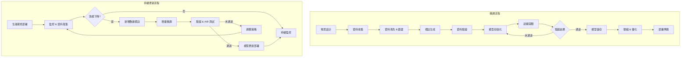

# CoLLMLight 專案程式碼說明文件

## 1. 專案概述

CoLLMLight 是一個基於大型語言模型（LLM）的網絡級交通信號控制系統。該系統通過協作式 LLM 代理框架來優化城市交通流量，減少擁堵。

### 1.1 主要特點

- 協作式 LLM 代理框架
- 結構化時空圖表示
- 複雜度感知推理機制
- 基於模擬的微調策略

### 1.2 核心創新

- **網絡級協作**：實現多路口間的協同決策
- **動態複雜度評估**：根據實時交通狀況調整推理深度
- **輕量級微調**：基於模擬數據的高效模型優化
- **記憶增強決策**：整合歷史經驗提升控制效果

## 2. 系統架構

### 2.1 目錄結構

```
.
├── models/             # 各種交通控制代理模型
├── framework/         # 核心框架實現
├── utils/            # 工具函數
├── data/             # 數據文件
│   └── FinetuneData/ # 微調數據集
└── media/            # 媒體資源
```

### 2.2 核心組件

#### 2.2.1 模型組件 (models/)

- `CoLLMLightAgent.py`: 主要的 LLM 代理實現
  - 協作式決策機制
  - 複雜度感知推理
  - 記憶管理系統
  
- `colight_agent.py`: CoLight 算法實現
  - 圖注意力網絡
  - 多代理協作機制
  
- `mplight_agent.py`: MPLight 算法實現
  - 最大壓力原則
  - 深度強化學習
  
- `presslight_one.py`: PressLight 算法實現
  - 壓力感知控制
  - 單路口優化
  
- `maxpressure_agent.py`: MaxPressure 算法實現
  - 傳統壓力控制
  - 無學習優化
  
- `network_agent.py`: 網絡代理基礎類
  - 代理通信接口
  - 狀態管理機制
  
- `chatgpt.py`: ChatGPT 接口實現
  - API 調用封裝
  - 響應處理邏輯

#### 2.2.2 框架組件 (framework/)

- `CoLLMlight.py`: 核心框架實現
  - 代理協作管理
  - 環境交互接口
  - 決策流程控制
  
- `FTSample.py`: 微調數據採樣實現
  - 數據收集策略
  - 樣本篩選機制
  - 標註生成邏輯

### 2.3 工具組件 (utils/)

- 數據預處理工具
- 評估指標計算
- 可視化功能
- 日誌記錄系統

## 3. 主要功能模塊

### 3.1 交通控制代理

系統實現了多種交通控制策略：

1. **CoLLMLight**
   - 基於 LLM 的協作式控制
   - 動態複雜度感知推理
   - 鄰近路口協調
   - 記憶增強決策機制

2. **傳統方法**
   - 固定時間控制 (FixedTime)
     * 預設時間配時方案
     * 週期性信號切換
   - 最大壓力控制 (MaxPressure)
     * 基於排隊長度優化
     * 實時壓力計算
   - 隨機控制 (Random)
     * 基準測試方案
     * 隨機信號選擇

3. **深度學習方法**
   - CoLight
     * 圖注意力網絡
     * 多代理協作學習
   - MPLight
     * 最大壓力原則
     * 深度強化學習優化
   - PressLight
     * 壓力感知控制
     * 端到端學習
   - AttendLight
     * 注意力機制
     * 自適應控制

### 3.2 訓練與優化

#### 3.2.1 數據收集

- **模擬環境交互**
  - 場景配置
  - 狀態採樣
  - 動作執行
  - 獎勵計算

- **實時數據處理**
  - 數據清洗
  - 特徵提取
  - 標準化處理
  - 時序對齊

#### 3.2.2 微調策略

1. **數據準備階段**
   - 場景設計
   - 數據收集
   - 標註生成
   - 質量控制

2. **模型優化階段**
   - 參數初始化
   - 梯度更新
   - 驗證評估
   - 模型選擇

3. **部署與應用**
   - 模型壓縮
   - 推理優化
   - 性能監控
   - 持續更新

## 4. 使用說明

### 4.1 環境要求

- Python >= 3.9
- TensorFlow-CPU = 2.8.0
- CityFlow
- 其他依賴：
  - pandas = 1.5.0
  - numpy = 1.26.2
  - wandb
  - transformers = 4.48.2
  - vllm
  - lmdeploy

### 4.2 安裝步驟

1. 克隆代碼倉庫：
```bash
git clone https://github.com/your-username/CoLLMLight.git
cd CoLLMLight
```

2. 安裝依賴：
```bash
pip install -r requirements.txt
```

3. 安裝 CityFlow：
```bash
git clone https://github.com/cityflow-project/CityFlow.git
cd CityFlow
pip install .
```

### 4.3 運行方式

1. 部署 LLM 服務器：
```shell
lmdeploy serve api_server YOUR_LLM_PATH --tp=YOUR_GPU_NUM
```

2. 運行 CoLLMLight：
```shell
python run_CoLLMlight.py --model_path=YOUR_LLM_PATH --dataset='newyork_28x7' --traffic_file='anon_28_7_newyork_real_double.json'
```

3. 運行其他基準方法：
```shell
python run_colight.py --dataset='newyork_28x7'
python run_mplight.py --dataset='newyork_28x7'
python run_presslight.py --dataset='newyork_28x7'
```

## 5. 性能特點

### 5.1 核心優勢

- **網絡級優化能力**
  - 多路口協同決策
  - 全局效益最大化
  - 擁堵傳播控制

- **適應性**
  - 動態場景適應
  - 複雜度自適應
  - 負載均衡能力

- **計算效率**
  - 輕量級推理
  - 並行處理
  - 資源優化

- **擴展性**
  - 模塊化設計
  - 靈活配置
  - 易於整合

- **魯棒性**
  - 異常處理
  - 容錯機制
  - 穩定性保證

### 5.2 性能指標

- 平均行程時間
- 停車次數
- 燃油消耗
- 排隊長度
- 吞吐量

## 6. 實驗場景

### 6.1 測試環境

1. **合成數據測試**
   - 理想路網
   - 可控變量
   - 極端情況

2. **真實世界數據測試**
   - 實際路網
   - 真實流量
   - 天氣影響

### 6.2 評估維度

- 不同交通流量條件
- 不同路網規模
- 不同時間段
- 特殊事件響應
- 系統穩定性

## 7. 開發指南

### 7.1 添加新的控制代理

1. 在 `models/` 目錄下創建新的代理類
2. 繼承 `agent.py` 中的基礎類
3. 實現必要的接口方法：
   - `get_state()`
   - `choose_action()`
   - `update()`
4. 在主程序中註冊新代理

### 7.2 數據處理

#### 7.2.1 基本原則

- 使用 `utils/` 中的工具函數處理數據
- 遵循 CityFlow 的數據格式規範
- 確保數據的時空一致性
- 處理缺失值和異常值

#### 7.2.2 數據預處理

1. 數據清洗
   - 異常值檢測
   - 缺失值處理
   - 數據標準化

2. 特徵工程
   - 時間特徵提取
   - 空間特徵構建
   - 統計特徵計算

### 7.3 數據格式說明

#### 7.3.1 路網配置文件 (roadnet_*.json)

路網配置文件定義了交通網絡的基本結構，包含以下主要部分：

```json
{
    "intersections": [
        {
            "id": "intersection_1",
            "point": {"x": 0, "y": 0},
            "width": 10,
            "roads": ["road_1", "road_2", "road_3", "road_4"],
            "trafficLight": {
                "lightphases": [
                    {
                        "phase": ["NSG", "EWR"],
                        "time": 30
                    },
                    {
                        "phase": ["NSR", "EWG"],
                        "time": 30
                    }
                ]
            }
        }
    ],
    "roads": [
        {
            "id": "road_1",
            "points": [
                {"x": -100, "y": 0},
                {"x": 0, "y": 0}
            ],
            "lanes": 3,
            "startIntersection": "intersection_0",
            "endIntersection": "intersection_1"
        }
    ]
}
```

#### 7.3.2 交通流量文件 (anon_*.json)

交通流量文件定義了車輛的行駛計劃：

```json
{
    "flow": [
        {
            "vehicle": {
                "length": 5.0,
                "width": 2.0,
                "maxPosAcc": 2.0,
                "maxNegAcc": 4.5,
                "usualPosAcc": 2.0,
                "usualNegAcc": 4.5,
                "minGap": 2.5,
                "maxSpeed": 11.111,
                "headwayTime": 2
            },
            "route": ["road_1", "road_2"],
            "interval": 3.0,
            "startTime": 0,
            "endTime": 3600
        }
    ]
}
```

#### 7.3.3 狀態數據格式

系統運行時的狀態數據格式：

```json
{
    "time": 3600,
    "vehicles": {
        "vehicle_1": {
            "speed": 10.0,
            "position": {"x": 100, "y": 200},
            "road": "road_1",
            "lane": 1
        }
    },
    "intersections": {
        "intersection_1": {
            "phase": 0,
            "waiting_vehicles": 5
        }
    }
}
```

#### 7.3.4 微調數據格式 (FinetuneData/*.json)

微調數據文件定義了用於訓練模型的問答對：

```json
[
  {
    "instruction": "你是一位交通號誌專家，負責管理一個四向交叉路口。你的主要任務是評估目前的協調程度，並實施合適的信號選擇策略。目標在於優化交通流與安全，不只考慮自己路口，也顧及鄰近上、下游路口的影響。",
    "input": {
      "背景說明": "[路口配置和交通狀況的詳細描述]",
      "數據": {
        "歷史觀測": "[包含多個時間點的交通數據表格]",
        "當前觀測": "[當前時間點的交通狀況數據]",
        "當地信號優先順序": "[各信號方案的優先級]"
      }
    },
    "output": {
      "phase1": {
        "thought_process": "思考過程描述",
        "answer": "協調類型（No-Coordination/Simple-Coordination/Complex-Coordination）"
      },
      "phase2": {
        "thought_process": "決策過程描述",
        "answer": "信號選擇（ETWT/NTST/ELWL/NLSL）"
      }
    }
  }
]
```

### 7.4 微調數據生成流程

1. **數據收集階段**
   - 模擬環境配置
   - 交通場景生成
   - 狀態序列採樣
   - 專家決策記錄

2. **數據處理階段**
   - 數據清洗和過濾
   - 特徵提取和轉換
   - 標準化和歸一化
   - 時序對齊處理

3. **標註生成階段**
   - 場景複雜度評估
   - 決策過程記錄
   - 結果標註生成
   - 質量控制檢查

4. **數據驗證階段**
   - 格式完整性檢查
   - 數據一致性驗證
   - 標註質量評估
   - 樣本多樣性分析

### 7.5 微調策略實現

1. **預處理階段**
   - 數據加載和驗證
   - 批次處理設置
   - 學習率調整
   - 損失函數定義

2. **訓練階段**
   - 模型參數初始化
   - 梯度更新策略
   - 驗證集評估
   - 早停機制實現

3. **後處理階段**
   - 模型壓縮優化
   - 推理性能提升
   - 部署準備工作
   - 持續更新機制

### 7.6 微調流程詳解



1. **場景設計**  
   - 定義目標路網、流量條件、評估指標（平均延遲、擁堵指數）  
2. **資料收集**  
   - 使用 CityFlow 模擬生成數據，或從歷史交通流量記錄擷取  
3. **資料清洗 & 篩選**  
   - 缺失值填補、異常值過濾、時間序列對齊  
4. **標註生成**  
   - 透過專家系統或規則自動生成 LLM 訓練樣本  
5. **資料驗證**  
   - 確保格式正確、標註一致性、高質量樣本  
6. **模型初始化**  
   - 設定超參數、選擇預訓練模型  
7. **訓練迴圈**  
   - 進行批次訓練，使用學習率調整與早停機制  
8. **驗證結果**  
   - 評估損失函數與 Traffic Metrics，如等待時間與通行率  
9. **模型儲存**  
   - 儲存最優模型，進行版本管理  
10. **壓縮 & 優化**  
    - 進行知識蒸餾或模型量化，提高推理效率  
11. **部署準備**  
    - 產生 API 並包裝成可用的服務  

## 8. 調試與優化

### 8.1 性能監控

1. **系統指標**
   - CPU 使用率
   - 內存佔用
   - 響應時間
   - 吞吐能力

2. **業務指標**
   - 決策準確率
   - 平均等待時間
   - 車輛通過率
   - 擁堵指數

### 8.2 問題排查

1. **日誌分析**
   - 錯誤日誌收集
   - 性能瓶頸定位
   - 異常行為追蹤
   - 系統狀態監控

2. **調試工具**
   - 性能分析器
   - 內存檢測器
   - 網絡分析器
   - 代碼覆蓋率工具

### 8.3 優化建議

1. **代碼層面**
   - 算法優化
   - 內存管理
   - 並發處理
   - 代碼重構

2. **系統層面**
   - 資源配置
   - 負載均衡
   - 緩存策略
   - 擴展性設計


